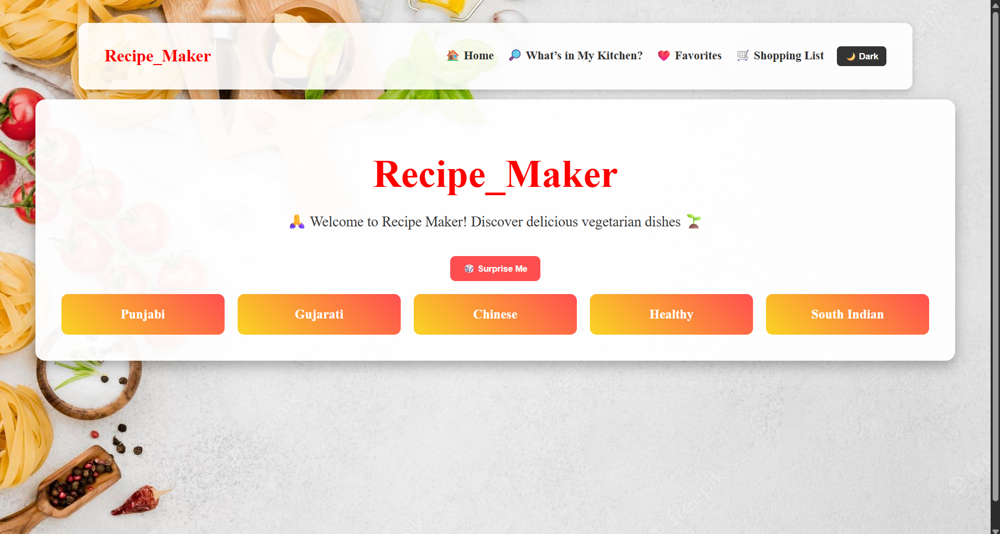
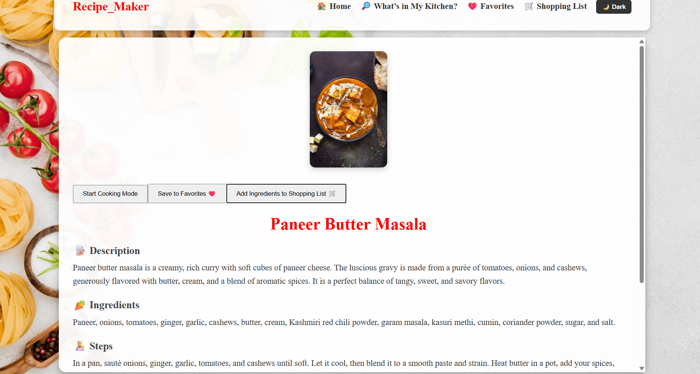
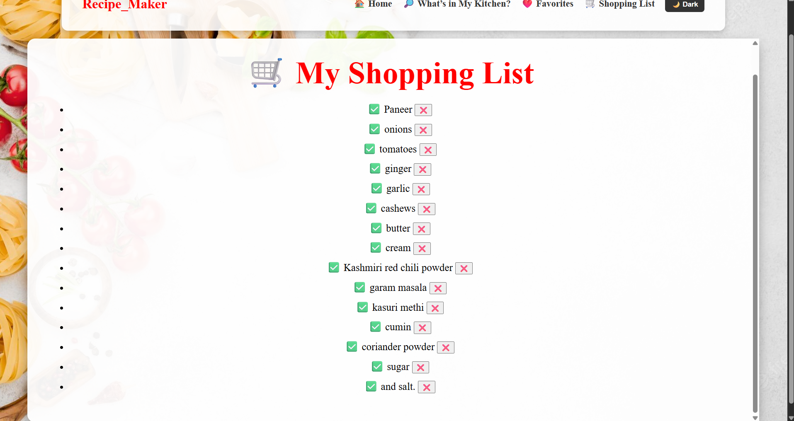
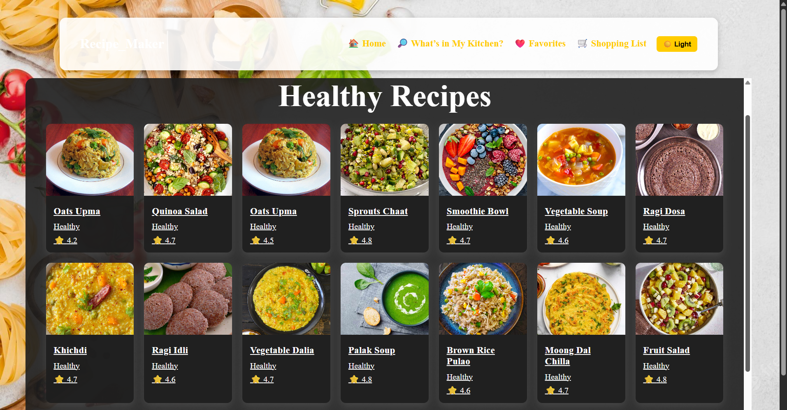

🍲 Recipe Founder

🚀 A full-stack recipe application built with React, Node.js, Express, and MySQL.
Recipe Founder is not just another recipe app — it’s interactive, smart, and vegetarian-friendly 🌱.

🌟 Features

🎲 Surprise Me → Get a random recipe suggestion instantly.
🥕 Ingredient-based Search → Find recipes with ingredients you already have.
❤️ Favorites → Save your favorite recipes to view later.
🛒 Shopping List → Add ingredients to a personal shopping list.
🌙 Dark Mode → Toggle between light and dark theme.
🍛 Categories → Explore by cuisine: Gujarati, Punjabi, Chinese, Healthy, South Indian.
👨‍🍳 Step-by-Step Cooking Mode → Follow recipes in slideshow style for easy cooking.

🛠️ Tech Stack

Frontend: React.js, CSS
Backend: Node.js, Express.js
Database: MySQL
Tools: Axios, CORS, GitHub

📸 Screenshots

🏠 Home Page

📖 Recipe Detail

🛒 Shopping List

🌙 Dark Mode

